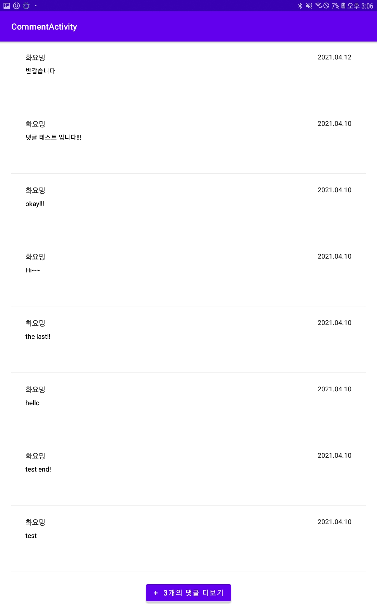
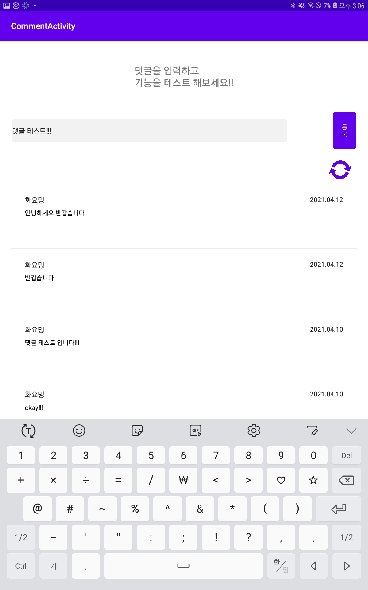

# CommentActivity
사용자가 댓글을 작성하고, 댓글 목록을 볼 수 있는 댓글 기능입니다.  
Android에서 공식적으로 지원하는 Volley 라이브러리를 사용하여 서버와의 통신을 구현했습니다.   

## 주 기능 

### 1. 댓글 로드 
* Fragment가 화면에 띄워질 때, 최근에 작성된 3개의 댓글을 확인할 수 있습니다.  
</img> 

* '+  n개의 댓글 더 보기' 버튼을 클릭할 때마다 n개의 댓글을 추가로 볼 수 있습니다.(n <= 3)  
</img>
</img> 

* '새로 고침' 버튼을 클릭하면, 댓글이 갱신됩니다.  
</img> 

### 2. 댓글 등록 
* 새로운 댓글을 등록하고 확인할 수 있습니다.  
</img>
</img>     

## 전체 설계도
Volley를 사용해 네트워크 작업을 실행하고 RecyclerView를 갱신하는 전체적인 동작 과정을 나타내는 블록 다이어그램은 다음과 같습니다.
1. Main Thread에서 StringRequest 객체를 생성하여 RequestQueue에 전달한다. 
2. RequestQueue에서 Thread를 실행시켜 서버에 요청한다. 
3. 받은 응답을 다시 Main Thread로 전달한다. 

통신을 수행하는 함수는 sendPOSTJournal_idRequest, sendPOSTComment_idRequest, sendPOSTUser_idRequest, sendPOSTCommentRequest로 총 4개로 구성되어 있습니다.
</img>  

## DB 정보
하나의 댓글 항목은 작성자 닉네임(nickname), 댓글 작성 시각(comment_date), 댓글 내용(comment)으로 구성했으며, 이와 관련한 DB정보는 다음과 같습니다.
* Journal [journal_id, comments] // comments = 전체 댓글 아이디 목록 ex) comments: 1, 6, 13, 25 
* User [user_id, nickname] 
* Comment [comment_id, user_id, comment_date, comment]  

## 동작 과정
### 1. 댓글 로드
* sendPOSTJournal_idRequest() -> journal_id를 담은 요청을 서버에 보내 comments 데이터를 응답 받는다. 각각의 댓글 데이터를 불러오기 위해 아래 과정을 comments에 담긴 comment_id 개수만큼 반복한다.
   * sendPOSTComment_idRequest() -> comment_id를 담은 요청을 서버에 보내고 user_id, comment_date, comment 데이터를  응답 받는다.
     * sendPOSTUser_idRequest() -> user_id를 담은 요청을 서버에 보내고 nickname을 응답 받는다. nickname,  comment_date, comment를 담은 하나의 댓글 항목을 전체 댓글 리스트에 추가한다. 마지막 댓글 항목이라면 RecyclerView를 갱신한다. 

### sendPOSTJournal_idRequest 함수
</img>  

### sendPOSTComment_idRequest 함수
</img>  

### sendPOSTUser_idRequest 함수
</img>   

### 2. 댓글 등록
* sendPOSTCommentRequest() -> user_id, comment_date, comment를 담은 요청을 서버에 전송하고 전체 댓글 리스트에 추가한 후, RecyclerView를 갱신한다.

### sendPOSTCommentRequest 함수
</img>  

