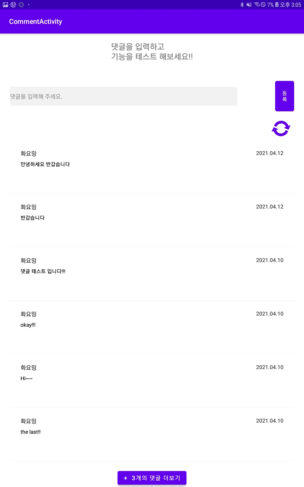

# CommentActivity
사용자가 댓글을 작성하고, 댓글 목록을 볼 수 있는 댓글 기능입니다.  
Android에서 공식적으로 지원하는 Volley 라이브러리를 사용하여 서버와의 통신을 구현했습니다.

## 주 기능

### 댓글 로드
* Fragment가 화면에 띄워질 때, 최근에 작성된 3개의 댓글을 확인할 수 있습니다.
* '+  n개의 댓글 더 보기' 버튼을 클릭할 때마다 n개의 댓글을 추가로 볼 수 있습니다.(n <= 3)
* '새로 고침' 버튼을 클릭하면, 댓글이 갱신됩니다.

### 댓글 등록
* 새로운 댓글을 등록하고 확인할 수 있습니다.

</img>
</img>
</img> 
</img>
</img>
</img> 
